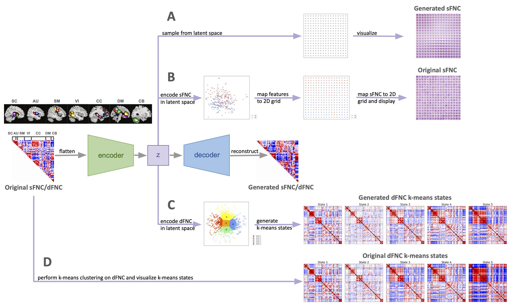

# Functional network connectivity interpolation

Code for the paper: Functional network connectivity interpolation captures neuropsychiatric continuum, heterogeneity, and metastates (under review)

